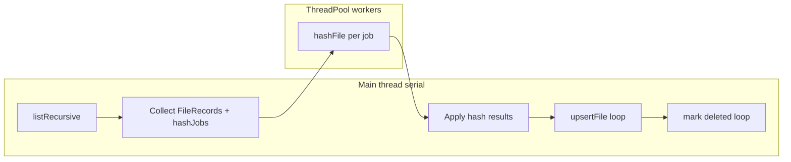

# Parallel Hashing in Scan (File_sync_engine)

**Scope:** Thread scan hashing only. Parallel `sync()` is out of scope for this phase.

## Goal

Speed up `SyncBox::scan()` by hashing changed files in parallel using `ThreadPool`. Keep filesystem listing, all SQLite reads/writes, and the delete-marking pass **serial** — only `hashFile()` runs on worker threads.

## Current status

| Step | Work | Status |
|------|------|--------|
| 1 | `Config::kHashWorkerThreads` + `resolveHashWorkerThreads()` | Done |
| 2 | `ThreadPool` utility (`include/utils/ThreadPool.hpp`, `src/utils/ThreadPool.cpp`) | Done (commit `9476637`) |
| 3 | Refactor `SyncBox::scan()` into collect / parallel hash / persist | Done |
| 4 | Build + manual timing tests | Pending |

**Problem today:** `scan()` calls `hashFile()` inline inside the per-file loop, so hashing blocks the loop and uses one core for disk reads.

## Architecture



**Thread-safety rules:**

- `hashFile()` — safe concurrently (each call opens its own `ifstream` + stack `Sha256Hasher`)
- `StateDb` — **never** call from workers (single `sqlite3*`, no locking)
- `Logger` — already mutex-protected

## Step 1 — Config (done)

**Files:** `include/config.hpp`, `src/config.cpp`

- `Config::kHashWorkerThreads = 0` → auto-detect CPU count, minimum 1
- `resolveHashWorkerThreads()` returns the config value if set, otherwise `max(1, hardware_concurrency())`

## Step 2 — ThreadPool (done)

**Files:** `include/utils/ThreadPool.hpp`, `src/utils/ThreadPool.cpp`, `CMakeLists.txt`

API:

- `ThreadPool(threadCount)` — spawns N worker threads
- `submit(task)` — enqueue work
- `waitAll()` — block until queue empty and no active tasks
- Destructor sets `stop_`, notifies workers, joins threads

## Step 3 — Refactor `SyncBox::scan()`

**File:** `src/sync/SyncBox.cpp`

### Pass 1 — Collect (serial, DB reads only)

1. `listRecursive()` — unchanged
2. For each entry:
   - `seenPaths.insert(info.relPath)`
   - `existing = db_.getFile(srcRootId_, info.relPath)` — serial
   - Build `FileRecord` (mtime, size, directory flags — same logic as today)
   - If `mtimeOrSizeChanged` and not a directory:
     - Push `{recordIndex, absPath}` into `hashJobs`
     - Leave `record.hash` unset until Pass 2
   - Else: reuse `existing->hash`
   - Compute `syncStatus` / `bytesTransferred` via existing `metadataChanged()` logic
   - Append to `std::vector<FileRecord> records`

### Pass 2 — Hash (parallel, no DB)

- Create `ThreadPool` with `resolveHashWorkerThreads()`
- Submit one `hashFile(absPath)` job per hash job
- `waitAll()`, apply hashes back to `records`
- Log warning on failure (same as today)

### Pass 3 — Persist (serial, DB writes only)

1. Loop `records` → `db_.upsertFile(record)`
2. Run existing mark-deleted loop unchanged

**Logging:** Add `SyncBox::scan: hash_jobs=%zu workers=%zu` after Pass 2. Keep existing summary line.

## Behavioral guarantees (must not change)

- Hash only when mtime or size changed
- Reuse stored hash when metadata unchanged
- Failed hash → `hash = nullopt` + warning; scan continues
- `syncStatus` / `bytesTransferred` reset via `metadataChanged()` unchanged
- Delete-detection pass unchanged
- No changes to `sync()`, `ChunkCopier`, or `StateDb`

## Step 4 — Build and verify

```bash
cmake --build build
```

| Test | Setup | Expected |
|------|-------|----------|
| Cold scan | Many new files under source | Hashes populated; sync still works |
| Incremental scan | Rerun with no changes | `unchanged` rises; `hash_jobs=0` |
| Single-file change | Touch one file's mtime | Only that file re-hashed |
| Worker tuning | `kHashWorkerThreads = 1` vs `0` (auto) | Lower `scan_ms` with auto on many changed files |
| Failure | Unreadable file | Warning + null hash; scan completes |

Compare `scan_ms` in `SyncBox::run` logs.

## Files touched

| File | Change |
|------|--------|
| `src/sync/SyncBox.cpp` | Three-pass scan refactor + ThreadPool include |

No CMake changes needed — `ThreadPool.cpp` is already registered.

## Out of scope (future phase)

- Parallel per-file `sync()` (needs `StateDb` mutex or per-thread SQLite)
- Parallel `listRecursive()`
- CLI `--workers` flag
- Chunk-level parallelism inside `ChunkCopier`
